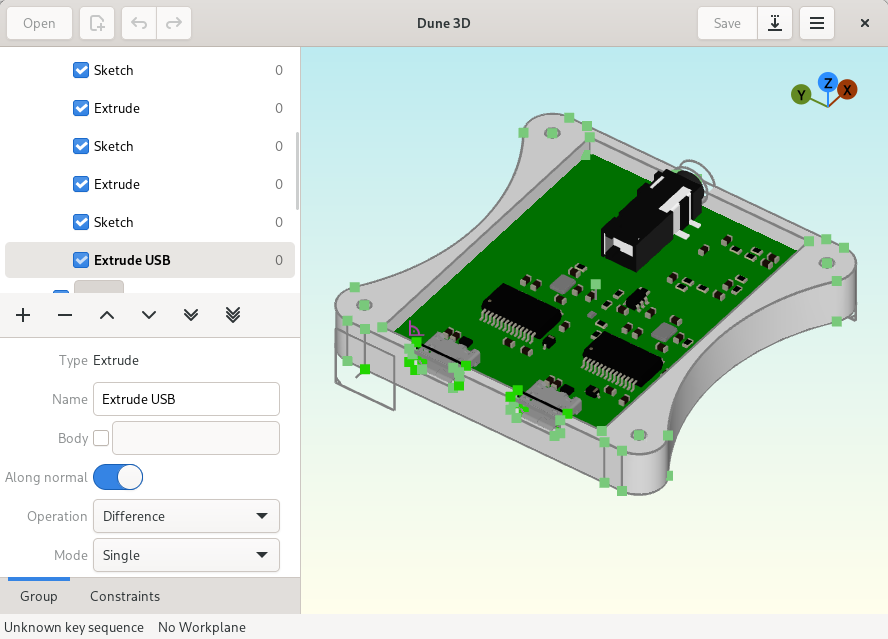

# Dune 3D

Dune 3D is a parametric 3D CAD application that supports STEP import/export, fillets and chamfers.

> [!WARNING]
> It's still in early development, so don't be surprised if it's janky, missing important features or crashes when you look at it the wrong way.

## Motivation

So why another open-source 3D CAD application when FreeCAD and Solvespace exist?
My primary use case for 3D CAD is designing 3D-printed enclosures for my electronics projects. I often found myself procrastinating designing the enclosure and attributed that to my dissatisfaction with the available open source 3D CAD applications.

While FreeCAD technically does everything I need, the way it's implemented isn't quite to my liking. My biggest pain points with it are the modal sketcher that only works in 2D, no constraints in 3D for extrusions and the perils of referencing things in the design.

Solvespace on the other hand gets the workflow part right, but falls short by not importing STEP and the geometry kernel not supporting chamfers and fillets.

Having solved the similar problem for PCB CAD by developing Horizon EDA, I began pondering whether I could pull off the same thing for 3D CAD. After all, what does it take to make a 3D CAD?

 - Geometry kernel to do extrusions, intersections, chamfers, etc.: While it's not a nice library to work with, Open CASCADE is the only viable choice if we want to have STEP import/export and fillets/chamfers. Fortunately, I have some experience with it from dealing with STEP files in Horizon EDA.
 - 3D viewport: Obviously, we need a way to put 3D geometry on screen, zoom/pan and select things. The 3D preview in Horizon EDA already does all of this, so I have a well-understood codebase I can reuse.
 - Constraint solver: Unlike with Horizon EDA where things just stay where you last moved them, in 3D CAD, it's commonplace to specify where things go by means of constraints that need to be solved. Turns out that Solvespace's solver is available as a library[^1], so that part's also covered.
 - Editor infrastructure: Last but not least, we need code that takes care of the tools, undo/redo and all of the other bits and pieces that make up an interactive editor. While there'll be some differences, I felt confident that I could reuse and adapt the interactive manipulator from Horizon EDA.

With all of the building blocks available, I set out to glue them together to form a 3D CAD application. About three months later, it's somewhat presentable.

[^1]: I ended up directly using solvespace's solver instead of the suggested [wrapper code](https://github.com/solvespace/solvespace/blob/master/exposed/DOC.txt) since it didn't expose all of the features I needed.
I also had to patch the solver to make it sufficiently fast for the kinds of equations I was generating by symbolically solving equations where applicable.

## How to build

See the [build instructions](https://docs.dune3d.org/en/latest/build-linux.html).

## How to use

Similar to Horizon EDA, all tools and actions are available from the spacebar menu.

Use the "set workplane" tool to set a group's workplane.

Also check out the [documentation](https://docs.dune3d.org/).

## Anticipated questions

### Where do I find sample files?

See the [samples](https://github.com/dune3d/samples) repository.

### Does it run on Windows?

See the [build instructions](https://docs.dune3d.org/en/latest/build-win32.html) for how to build on Windows.

### Does it run on macOS?

See the [build instructions](https://docs.dune3d.org/en/latest/build-macos.html) for how to build on macOS.

### Why not integrate it into Horizon EDA?

There's no place in Horizon EDA where a 3D CAD would make sense to implement. Also, I wanted to do some things differently and give Gtk 4 a try.

### Why not improve Solvespace or FreeCAD?

Making FreeCAD parametric in 3D or putting Open CASCADE into Solvespace seemed to be too big a change to pull off as an outside contributor to either project. I also really like writing CAD software, so here we are.

